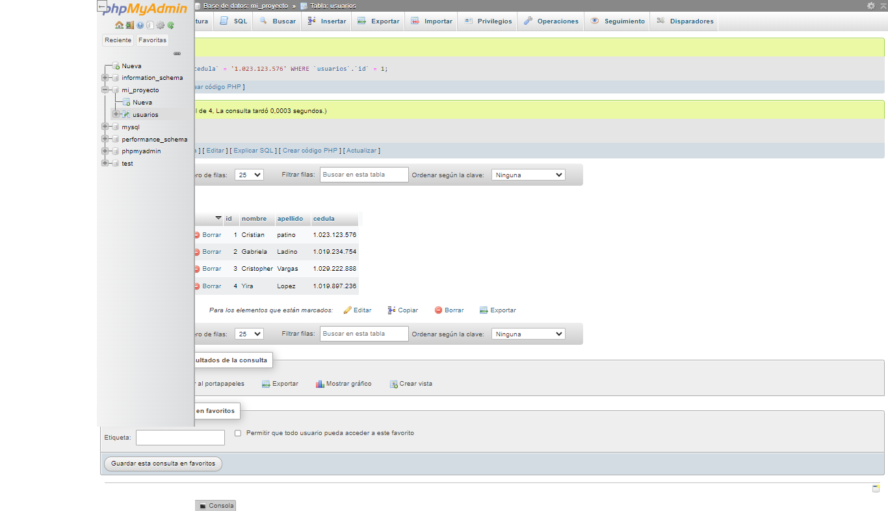
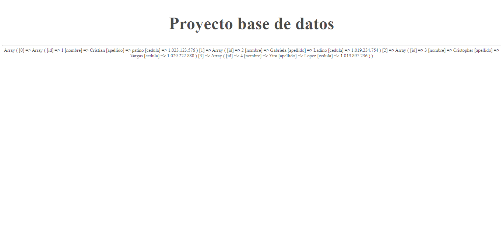
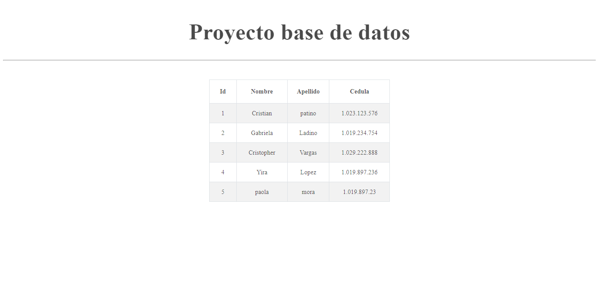

<h1>Taller 10: Karina Rojas Tavera</h1>

<h2>Información</h2>

Curso: Full Stack Basico-Grupo 1 

Profesor: Cristian Patiño

<h2>punto 1:</h2>

<h2>punto 2:</h2>

<h2>punto 3:</h2>
<h3>3 - Pedir Nombre Apellido y Cedula al usuario</h3>

<h2>punto 4:</h2>

<h2>punto 5-6-7:</h2>
<h3>5 - Base de datos</h3>

<h3>6 - Conexión</h3>

<h3>7 - Muestra de datos en pantalla</h3>

